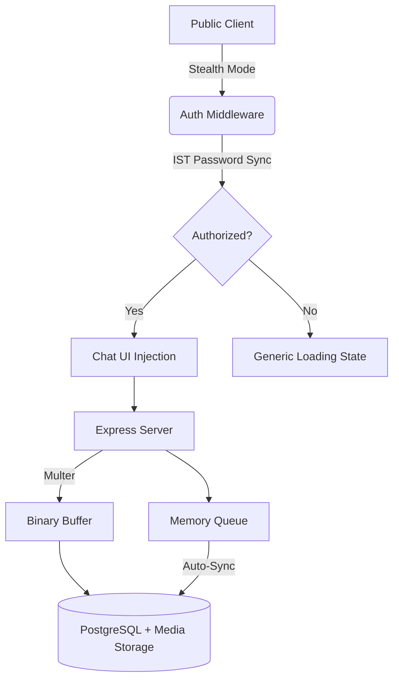

# 🛡️ Secure Ephemeral Chat (Co)

A state-of-the-art, premium ephemeral communication platform engineered for high-privacy environments. This application prioritizes stealth, robust data handling, and professional aesthetics, providing a secure bridge for communication that feels "invisible" until authorized.

---

## 🚀 Product Scope & Vision

The platform is designed for users who require a high degree of privacy without sacrificing the power of a modern chat interface. It serves three primary scopes:
1. **Privacy-First Communication**: Stealth-entry system avoids drawing attention.
2. **Reliable Data Exchange**: Production-grade file handling and offline queuing.
3. **Seamless Monitoring**: Integrated health diagnostics for 24/7 uptime monitoring.

---

## ✨ Key Features

### 🟢 1. Triple-Layer Stealth & Security
- **Invisible Entry**: Launches to a generic "Computing..." screen. No login forms or buttons are visible to casual observers.
- **Dynamic IST Password**: Authentication is synchronized with **Indian Standard Time (IST)**. Even if local time is changed on the device, only the IST date (`DD8080`) will grant access.
- **Multi-Server Architecture**: Support for multiple isolated servers using pattern `DDXXXX` where `XXXX` is a 4-digit server ID. Each server has completely separate message and media storage.
- **Auto-Inactivity Wipe**: The application automatically "re-locks" and wipes sensitive UI data after 5 seconds of inactivity, returning to its stealth state.

### 📎 2. Advanced Attachment Engine
- **Global Dropzone**: Functional across the entire application—even in the locked "Computing" state. Drag and drop any file to pre-stage an upload.
- **Stealth Indicators**: A subtle filename display confirms file selection without exposing the chat interface.
- **Production Media Support**: High-performance handling of images and binary files via Postgres `bytea` storage.
- **Rich Previews**: Automatic thumbnail generation for images and specialized file icons for documents/binaries.

### 🏛️ 3. Architecture & Reliability
- **Offline Persistence**: Uses a client-side and server-side queuing strategy. If the database connection drops, messages are safely queued and synchronized once the heartbeat restores.
- **Session Isolation**: Secure, encrypted cookie-based sessions with HTTP-only and SameSite flags optimized for production.
- **Lazy Loading**: High-resolution media is loaded on-demand to optimize bandwidth and initial render speed.

---

## 🛠️ System Architecture



---

## 📂 API Reference

### 🔐 Authentication
`POST /api/login`
- **Body**: `{ "password": "DD8080" }`
- **Logic**: Validates against `Intl.DateTimeFormat` (Asia/Kolkata).

### 💬 Messaging
`GET /api/messages`
- Returns last 100 entries with media metadata.

`POST /api/messages`
- Supports `multipart/form-data` for file uploads.
- Automatic integration with the offline queuing system.

### 📥 Media
`GET /api/media/:id`
- Streams binary data directly from the database with appropriate MIME headers.

### 🩺 Monitoring
`GET /health`
- **Real-time Diagnostics**:
    - `environment`: Deployment stage (prod/dev).
    - `uptime`: Server lifecycle duration.
    - `memory`: Precise heap usage (Used/Total/RSS).
    - `database`: Real-time connectivity and queue depth.

---

## ⚙️ Configuration

| Variable | Description | Default |
| :--- | :--- | :--- |
| `PORT` | Listening port for the application | `3000` |
| `DATABASE_URL` | PostgreSQL connection string | *Required* |
| `SESSION_SECRET` | Secret key for encrypted cookies | `secret_key_123` |

### 🔀 Multi-Server Setup

The application supports multiple isolated servers. Configure available servers in `config.js`:

```javascript
const SERVERS = ['1234', '5678', '9999'];
```

**Password Format**: `DDXXXX`
- `DD` = Current day (IST)
- `XXXX` = 4-digit server ID from the configured list

**Example**: On February 8th:
- `081234` → Access server 1234
- `085678` → Access server 5678
- `089999` → Access server 9999

Each server maintains completely isolated:
- Message table: `messages_XXXX`
- Media table: `media_XXXX`

See [MULTI_SERVER_GUIDE.md](./MULTI_SERVER_GUIDE.md) for detailed setup instructions.

---

## 🏃 Getting Started

### Local Development
1. **Prepare Environment**:
   ```bash
   cp .env.example .env # Create your .env file
   ```
2. **Install & Start**:
   ```bash
   npm install
   npm start
   ```
3. **Access**: Navigate to `http://localhost:3000`.

### Production Deployment (Render/Docker)
The application includes a `Dockerfile` for streamlined containerized deployment.
1. Connect this repository to **Render**.
2. Select **Web Service** and choose **Docker** as the environment.
3. Add your `DATABASE_URL` and `SESSION_SECRET` to the environment variables.

---

## 🗺️ Roadmap & Future Scope
- [ ] **End-to-End Encryption (E2EE)**: Implementing client-side Web Crypto API for message bodies.
- [ ] **Self-Destruct Timers**: Individual message TTL (Time To Live).
- [ ] **PWA Support**: Offline-capable progress web app with service worker notifications.
- [ ] **Admin Dashboard**: A separate stealth route for database cleanup and user auditing.

---

## 🎨 Tech Stack
- **Engine**: Node.js (v18+) & Express
- **Storage**: PostgreSQL (Relational + Binary)
- **Styling**: Vanilla CSS (Tailored UI/UX)
- **Auth**: Cookie-Session & IST Time-Sync
- **Uploads**: Multer Buffer Management
